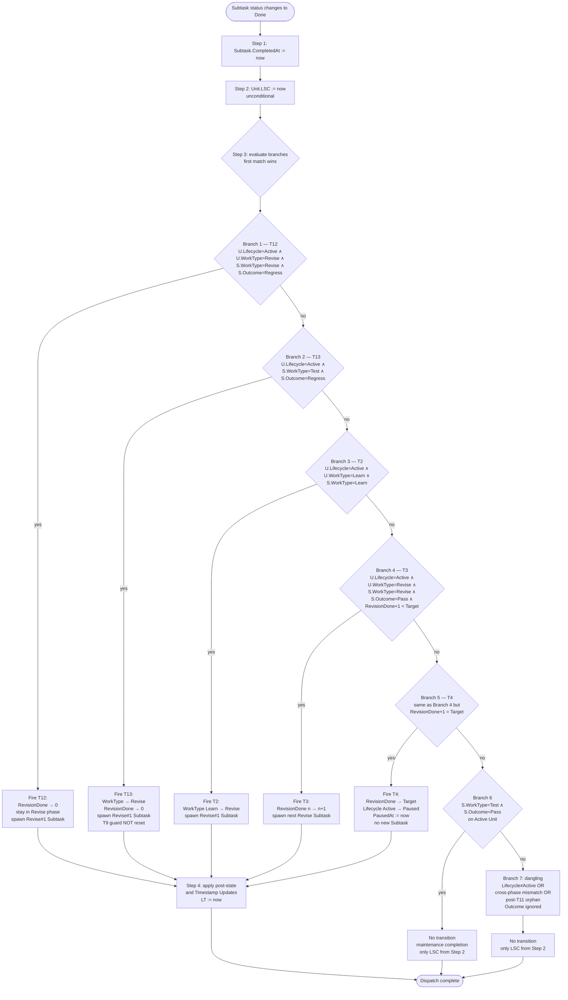

# Implementation Test Matrix

> **Status:** Derived reference · v0.7.7 · **Last updated:** 2026-04-17 · **Source of truth:** [`LivingRequirements.md`](./LivingRequirements.md) v0.7.7

This document is a **derived, non-normative** reference for implementers and test authors. Every row here is deducible from the state machine (`§5.2`), the dispatch rule (`§5.5`), and the staleness projection (`§5.7`) in [`LivingRequirements.md`](./LivingRequirements.md). The matrix exists so that an implementation can be validated row-by-row without re-deriving dispatch semantics from prose.

**Authority rule:** if a row in this document conflicts with [`LivingRequirements.md`](./LivingRequirements.md) §5, the main document wins and this matrix is stale.

Legend:
- **`S`** = Subtask · **`U`** = Unit · **LSC** = `LastSubTaskCompletedAt` · **LT** = `LastTransitionedAt`
- **`n`** = `U.RevisionDone` at the time of the event · **`Target`** = `U.RevisionTarget`
- ✓ = written, — = not written, `*` = any value (don't-care)

---

## 1. How to Read the Matrix

### 1.1 What §3 (Dispatch Branch Matrix) enumerates

Every row in §3 below is **one possible input state** for a single `Subtask → Done` event. The input state is the 4-tuple `(S.WorkType, U.Lifecycle, U.WorkType, S.Outcome)` — the four fields the dispatch algorithm in [`LivingRequirements.md §5.5`](./LivingRequirements.md) inspects. `S.Outcome` is defined only on `Revise` and `Test` Subtasks ([`LivingRequirements.md §4`](./LivingRequirements.md)); on `Learn` Subtasks the column is marked `—` (n/a). For Revise+Pass combinations a fifth "Extra guard" column splits the row on the `RevisionDone` boundary (`n+1 < Target` vs. `n+1 = Target`) because that comparison selects between T3 and T4.

### 1.2 Input columns → §5.5 branches

[`LivingRequirements.md §5.5`](./LivingRequirements.md) step 3 defines **seven** branches as of v0.7.7 (v0.7.6 added two Regress bullets ahead of the legacy Pass path), evaluated in order (first match wins). Each row in §3 lands on exactly one of them:

| §5.5 branch | Branch label (§3) | Matching input pattern | Transition fired |
|---|---|---|---|
| 1 | "1 (Revise-Regress)" | `S.WorkType = Revise` ∧ `U.Lifecycle = Active` ∧ `U.WorkType = Revise` ∧ `S.Outcome = Regress` | **T12** |
| 2 | "2 (Test-Regress)" | `S.WorkType = Test` ∧ `U.Lifecycle = Active` ∧ `S.Outcome = Regress` | **T13** |
| 3 | "3 (Learn→Revise)" | `S.WorkType = Learn` ∧ `U.Lifecycle = Active` ∧ `U.WorkType = Learn` | **T2** |
| 4 | "4 (Revise next)" | `S.WorkType = Revise` ∧ `U.Lifecycle = Active` ∧ `U.WorkType = Revise` ∧ `S.Outcome = Pass` ∧ `RevisionDone + 1 < RevisionTarget` | **T3** |
| 5 | "5 (Revise auto-pause)" | `S.WorkType = Revise` ∧ `U.Lifecycle = Active` ∧ `U.WorkType = Revise` ∧ `S.Outcome = Pass` ∧ `RevisionDone + 1 = RevisionTarget` | **T4** |
| 6 | "6 (Test Pass)" | `S.WorkType = Test` ∧ `S.Outcome = Pass` (regardless of Unit state on Active; dangling otherwise) | — (maintenance) |
| 7 | "7 (dangling)" | anything else — every combination that fails the above | — (dangling) |

**Branches 1–2 are the v0.7.6 Regress additions.** They are evaluated **before** the Pass path so the user's explicit `Outcome = Regress` pre-empts T3/T4 on the same tuple. Default `Outcome = Pass` preserves the v0.7.5 dispatch exactly.

**Branch 7 is the catch-all.** It covers distinct classes of input that all share the same outcome (LSC only, no transition):
- **Lifecycle ≠ Active** — any Subtask `→ Done` on a `Paused` or `Archived` Unit falls through, because branches 1–5 explicitly require `Active`. `Outcome` is ignored in this branch ([`LivingRequirements.md §5.3`](./LivingRequirements.md) disables the regress path outside `Active`).
- **Post-T11 orphan** — a Revise Subtask completed on a Unit whose phase was reset to `Learn` by T11 (or, symmetrically, a Learn Subtask completed after the Unit advanced to `Revise` via T2).
- **Cross-phase mismatch** — any combination of Subtask.WorkType and Unit.WorkType not listed in branches 1–5.

### 1.3 Output columns

For each row, §3 records:
- **§5.5 branch** — which of the seven branches above matched.
- **Transition fired** — T2/T3/T4/T12/T13 if branches 3/4/5/1/2 matched; `—` otherwise.
- **Post-tuple delta** — the change (if any) applied to `(Stage, WorkType, Lifecycle, RevisionDone)` plus any Subtask spawned. `none` means the Unit tuple is unchanged.
- **LSC** — always ✓ (written by [`LivingRequirements.md §5.5`](./LivingRequirements.md) step 2, unconditionally, before dispatch).
- **LT** — ✓ iff the transition actually fired and its [`LivingRequirements.md §5.2`](./LivingRequirements.md) row lists an `LT := now` write.
- **Other writes** — any `PausedAt` write or other side-effect from the transition's Timestamp Updates column.

### 1.4 Reading a specific row

Pick any observed or hypothetical `Subtask → Done` event in your implementation, form the 4-tuple `(S.WorkType, U.Lifecycle, U.WorkType, S.Outcome)`, match it against §3's first five columns, and the remaining columns give you the expected result. If your implementation's behavior diverges from any matched row's outputs, either the implementation has a bug or §5 has been amended; consult the Change Log in [`LivingRequirements.md §11`](./LivingRequirements.md) to decide which.

---

## 2. Visual Overview

### 2.1 Dispatch flowchart (`Subtask → Done` handling — [`LivingRequirements.md §5.5`](./LivingRequirements.md))



### 2.2 Unit lifecycle state diagram (transitions T1–T13 — [`LivingRequirements.md §5.2`](./LivingRequirements.md))

States are labelled by the `(WorkType, Lifecycle)` slice of the tuple; `Stage` advances on T5/T11 (with `next(Advanced) = Advanced` per [`LivingRequirements.md §2`](./LivingRequirements.md) / OQ-20) but is orthogonal to the graph shape, and `RevisionDone` is an internal counter shown as a guard on T3/T4. T12 (Revise-Regress) and T13 (Test-Regress) are the v0.7.6 opt-in backward-motion transitions (§3 Principle 7).

```mermaid
stateDiagram-v2
    [*] --> LearnActive: T1 (create)<br/>tuple := (Beginner, Learn, Active, 0)<br/>LSC,LT,CreatedAt := now

    LearnActive: Learn / Active
    ReviseActive: Revise / Active
    RevisePaused: Revise / Paused (at Target)
    Paused: * / Paused (mid-chain)
    Archived: * / Archived

    LearnActive --> ReviseActive: T2 (Learn Subtask → Done)<br/>spawn Revise#1 · LT := now

    ReviseActive --> ReviseActive: T3 (Revise → Done, Pass, n+1 &lt; Target)<br/>RevisionDone++ · LT := now

    ReviseActive --> RevisePaused: T4 (Revise → Done, Pass, n+1 = Target)<br/>Lifecycle → Paused<br/>LT,PausedAt := now

    ReviseActive --> ReviseActive: T12 (Revise → Done, Regress)<br/>RevisionDone := 0<br/>spawn Revise#1 · LT := now
    LearnActive --> ReviseActive: T13 (Test → Done, Regress)<br/>WorkType := Revise<br/>RevisionDone := 0<br/>spawn Revise#1 · LT := now<br/>T9 guard NOT reset
    ReviseActive --> ReviseActive: T13 (Test → Done, Regress)<br/>RevisionDone := 0<br/>spawn Revise#1 · LT := now

    LearnActive --> Paused: T8 (user pauses)<br/>PausedAt := now
    ReviseActive --> Paused: T8 (user pauses)<br/>PausedAt := now

    LearnActive --> Archived: T7 (user archives)
    ReviseActive --> Archived: T7
    Paused --> Archived: T7
    RevisePaused --> Archived: T7

    Paused --> ReviseActive: T6 (user resumes, n &lt; Target)<br/>spawn next Revise · LT := now
    RevisePaused --> LearnActive: T5 (user resumes, n ≥ Target)<br/>Stage := next(Stage)<br/>tuple reset · LT := now
    Paused --> LearnActive: T5 (user resumes, n ≥ Target)
    Archived --> LearnActive: T5 (user resumes, n ≥ Target)
    Archived --> ReviseActive: T6 (user resumes, n &lt; Target)

    note right of ReviseActive
        T9 (weekly scan):<br/>self-loop, spawns Test Subtask<br/>no tuple change, no LT write<br/>guarded by §4 T9 Idempotency table
        T10 (edit RevisionTarget):<br/>LT := now; may cascade to T4
        T11 (edit Stage directly):<br/>tuple reset to (newS, Learn, Active, 0)
        Test Subtask → Done, Outcome=Pass:<br/>maintenance — LSC only (no edge)
    end note
```




---

## 3. Dispatch Branch Matrix — `Subtask → Done` outcomes

The dispatch rule ([`LivingRequirements.md §5.5`](./LivingRequirements.md) step 3) has **7 branches** as of v0.7.6 (v0.7.5 had 5; v0.7.6 added the two Regress bullets ahead of the Pass path). This table enumerates every combination of `S.WorkType × U.Lifecycle × U.WorkType × S.Outcome` (plus the Target-boundary sub-case for Revise+Pass) and maps each to the branch that fires, the resulting transition (if any), and the timestamp writes on the Unit.

`S.Outcome` is defined only on `Revise` and `Test` Subtasks ([`LivingRequirements.md §4`](./LivingRequirements.md)); on `Learn` Subtasks the column is marked `n/a`. On `Paused` and `Archived` Units the Outcome is ignored (§5.3); those rows use `any` and collapse both values into a single row.

LSC is written by [`LivingRequirements.md §5.5`](./LivingRequirements.md) step 2 **unconditionally** on every row (before dispatch). The "LSC" column below reflects that write; the "LT" column reflects the transition's own Timestamp Updates.

| # | `S.WorkType` | `U.Lifecycle` | `U.WorkType` | `S.Outcome` | Extra guard | §5.5 branch | Transition fired | Post-tuple delta | LSC | LT | Other writes |
|---|---|---|---|---|---|---|---|---|---|---|---|
| D1 | `Test` | `Active` | `Learn` | `Pass` | — | 6 (Test Pass) | — | none | ✓ | — | — |
| D2 | `Test` | `Active` | `Learn` | `Regress` | — | 2 (Test-Regress) | **T13** | `WorkType: Learn → Revise`; `RevisionDone := 0`; spawn Revise#1 Subtask | ✓ | ✓ | T9 guard unchanged |
| D3 | `Test` | `Active` | `Revise` | `Pass` | — | 6 (Test Pass) | — | none | ✓ | — | — |
| D4 | `Test` | `Active` | `Revise` | `Regress` | — | 2 (Test-Regress) | **T13** | `RevisionDone: n → 0`; spawn Revise#1 Subtask | ✓ | ✓ | T9 guard unchanged |
| D5 | `Test` | `Paused` | `Learn` | any | — | 7 (dangling, Lifecycle≠Active) | — | none | ✓ | — | — |
| D6 | `Test` | `Paused` | `Revise` | any | — | 7 (dangling, Lifecycle≠Active) | — | none | ✓ | — | — |
| D7 | `Test` | `Archived` | `Learn` | any | — | 7 (dangling) | — | none | ✓ | — | — |
| D8 | `Test` | `Archived` | `Revise` | any | — | 7 (dangling) | — | none | ✓ | — | — |
| D9 | `Learn` | `Active` | `Learn` | n/a | — | 3 (Learn→Revise) | **T2** | `WorkType: Learn → Revise`; spawn Revise#1 Subtask | ✓ | ✓ | — |
| D10 | `Learn` | `Active` | `Revise` | n/a | — | 7 (dangling, cross-phase) | — | none | ✓ | — | — |
| D11 | `Learn` | `Paused` | `Learn` | n/a | — | 7 (dangling, Lifecycle≠Active) | — | none | ✓ | — | — |
| D12 | `Learn` | `Paused` | `Revise` | n/a | — | 7 (dangling) | — | none | ✓ | — | — |
| D13 | `Learn` | `Archived` | `Learn` | n/a | — | 7 (dangling) | — | none | ✓ | — | — |
| D14 | `Learn` | `Archived` | `Revise` | n/a | — | 7 (dangling) | — | none | ✓ | — | — |
| D15 | `Revise` | `Active` | `Learn` | `Pass` | — | 7 (dangling, post-T11 orphan) | — | none | ✓ | — | — |
| D16 | `Revise` | `Active` | `Learn` | `Regress` | — | 7 (dangling — Branch 1 requires `U.WorkType=Revise`) | — | none | ✓ | — | — |
| D17 | `Revise` | `Active` | `Revise` | `Pass` | `n+1 < Target` | 4 (Revise next) | **T3** | `RevisionDone: n → n+1`; spawn Revise#(n+2) Subtask | ✓ | ✓ | — |
| D18 | `Revise` | `Active` | `Revise` | `Pass` | `n+1 = Target` | 5 (Revise auto-pause) | **T4** | `RevisionDone: Target−1 → Target`; `Lifecycle: Active → Paused`; no new Subtask | ✓ | ✓ | `PausedAt := now` |
| D19 | `Revise` | `Active` | `Revise` | `Regress` | any n | 1 (Revise-Regress) | **T12** | `RevisionDone: n → 0`; stay in Revise phase; spawn Revise#1 Subtask | ✓ | ✓ | — |
| D20 | `Revise` | `Paused` | `Learn` | any | — | 7 (dangling, Lifecycle≠Active) | — | none | ✓ | — | — |
| D21 | `Revise` | `Paused` | `Revise` | any | — | 7 (dangling, Lifecycle≠Active) | — | none | ✓ | — | — |
| D22 | `Revise` | `Archived` | `Learn` | any | — | 7 (dangling) | — | none | ✓ | — | — |
| D23 | `Revise` | `Archived` | `Revise` | any | — | 7 (dangling) | — | none | ✓ | — | — |

**Invariants verifiable from this table:**
- **LSC is always written.** Every row has `LSC = ✓`. This is [`LivingRequirements.md §5.5`](./LivingRequirements.md) step 2.
- **LT is written iff a transition fired.** Rows D2, D4, D9, D17, D18, D19 are the only ones firing a transition, and they are the only rows with `LT = ✓`.
- **5 rows out of 23 advance Unit state on a Subtask → Done** (T2, T3, T4, T12, two T13 rows). All other Subtask completions are maintenance-only (from the Unit's perspective) or dangling.
- **Regress bullets pre-empt Pass bullets.** On `Active × Revise × Revise`, `Outcome = Regress` (D19) matches Branch 1 before the Target-boundary check on Pass (D17/D18) is consulted.
- **Outcome is ignored outside Active.** Rows D5–D8, D20–D23 collapse both Outcome values into a single row; §5.3 disables the regress path on non-Active Lifecycles regardless of the Subtask's Outcome flag.
- **`Learn` has no Outcome.** Rows D9–D14 mark Outcome as `n/a`; no Regress path exists for Learn (a failed Learn is modelled by not completing the Subtask — [`LivingRequirements.md §4`](./LivingRequirements.md)).
- **T13 does not re-arm T9** (rows D2, D4). The `HasHadTest` guard is consumed on first Test-Subtask creation and is not reset by T13 ([`LivingRequirements.md §5.2`](./LivingRequirements.md) T13 note; §4 row E6).
- **Set applicability ([`LivingRequirements.md §5.3`](./LivingRequirements.md)):** rows D2, D4, D9, D17, D18, D19 do not apply to `Independent` Sets (T2/T3/T4/T12/T13 don't fire there; Outcome is ignored on Independent — Subtask → Done writes LSC only). On Independent Units every Subtask → Done collapses to "LSC only".

---

## 4. T9 Idempotency Truth Table — weekly revive scan eligibility

Inputs evaluated per Unit at scan time:
- **S (Stale)** — `(now − U.LSC) > AgingThreshold` · Boolean
- **H (HasHadTest)** — "A `Test` Subtask has ever been created on this Unit in its history (regardless of current Status or whether later deleted)" · Boolean
- **O (HasOutstandingSubtask)** — "At least one Subtask on this Unit is in `Todo` or `InProgress`" · Boolean
- **L (Lifecycle)** — `∈ {Active, Paused, Archived}`
- **K (Set.Kind)** — `∈ {Core, Extended, Independent}`

**Firing condition (from [`LivingRequirements.md §5.2`](./LivingRequirements.md) T9 pre-state + [`§5.3`](./LivingRequirements.md) applicability):**

```
T9 fires  ≡  (K ≠ Independent) ∧ (L = Active) ∧ (S = true) ∧ (H = false) ∧ (O = false)
```

All other input combinations result in a no-op. The table below enumerates the fire case plus one row per distinct blocking reason (evaluated in the order listed; first blocker wins in the "Reason" column):

| # | K | L | S | H | O | T9 fires? | Primary blocker | Outcome on Unit | Unit still appears in [§12.3](./LivingRequirements.md) Stale View? |
|---|---|---|---|---|---|---|---|---|---|
| E1 | `Core`/`Extended` | `Active` | T | F | F | **✓ Yes** | — | Auto-create Test Subtask per [`LivingRequirements.md §5.2`](./LivingRequirements.md) T9 | Yes (until that Test Subtask's completion refreshes LSC) |
| E2 | `Independent` | `Active` | T | F | F | No | Set applicability ([`§5.3`](./LivingRequirements.md)) | none | No — Independent Units are excluded from [`§12.3`](./LivingRequirements.md) |
| E3 | `Core`/`Extended` | `Paused` | T | F | F | No | `Lifecycle ≠ Active` | none | Yes — grouped under `Paused`; user-initiated revival required |
| E4 | `Core`/`Extended` | `Archived` | T | F | F | No | `Lifecycle ≠ Active` | none | Yes — grouped under `Archived`; user-initiated revival required |
| E5 | `Core`/`Extended` | `Active` | F | F | F | No | Not Stale | none | No — Stale View filter rejects |
| E6 | `Core`/`Extended` | `Active` | T | **T** | F | No | Idempotency cap (lifetime) | none | Yes — Unit remains visible but T9 never fires again |
| E7 | `Core`/`Extended` | `Active` | T | F | **T** | No | Outstanding Subtask exists | none | Yes (Active group); user must close or `Backlog` the outstanding Subtask |
| E8 | `Core`/`Extended` | `Active` | T | T | T | No | (multiple) — Idempotency wins by order | none | Yes |
| E9 | `Core`/`Extended` | `Active` | F | T | T | No | Not Stale (short-circuits Stale View) | none | No |
| E10 | `Independent` | * | * | * | * | No | Set applicability | none | No — never enters [`§12.3`](./LivingRequirements.md) |

**Invariants:**
- **Exactly one firing pattern.** Only row E1 fires T9; every other combination is a no-op. An implementation's T9 job can be validated by checking `fired = (K ≠ Independent) ∧ (L = Active) ∧ S ∧ ¬H ∧ ¬O`.
- **H is durable.** Once `H` flips from `false` to `true` (first Test Subtask creation on a Unit), it **never** flips back — not on Subtask deletion, not on Stage upgrade (T5/T11), not on Archive (T7) or Resume (T5/T6), **not on a T13 regress re-entry** ([`LivingRequirements.md §5.2`](./LivingRequirements.md) T13 note). Row E6 therefore describes a terminal condition for T9 on that Unit.
- **Stale View ([`LivingRequirements.md §12.3`](./LivingRequirements.md)) membership is independent of H.** A Unit can be listed in the Stale View for years without T9 ever firing on it again (row E6). The view is for user situational awareness; T9 is the only auto-writer.
- **Evaluation order for the blocker column is documentary only.** The spec does not mandate evaluation order — any implementation that returns `fired = false` when any blocker is true satisfies the contract.

**Suggested unit tests (one per row):** E1 (positive path), E2–E4 (Lifecycle/Set filters), E5 (non-Stale skip), E6 (idempotency — the most important negative test), E7 (outstanding-Subtask skip). E8–E10 are redundant from a branch-coverage perspective but useful as regression guards.

---

## 5. Timestamp Write Reference — LSC & LT per transition path

This table enumerates every path through the state machine that can result in a write to `LSC` (`LastSubTaskCompletedAt`) or `LT` (`LastTransitionedAt`), and identifies the **sole writer** for each. Use it to audit an implementation: every code path that mutates a Unit must appear here, and no path outside this table may write LSC or LT.

Notation: **W** = writer authority (the section / step that performs the write); **Trigger** = the event that initiates the path. Rows are grouped by originating event class.

### 5.1 Unit-creation path

| Path | Trigger | Transition | LSC written? | LT written? | Other Unit writes | Writer (W) |
|---|---|---|---|---|---|---|
| P1 | Unit created | **T1** | ✓ | ✓ | `CreatedAt := now` | [`LivingRequirements.md §5.2`](./LivingRequirements.md) T1 (direct; no §5.5 involvement) |

**Note:** T1 is the **only** LSC writer that is not [`LivingRequirements.md §5.5`](./LivingRequirements.md) step 2, because T1 fires on Unit creation — there is no triggering Subtask `→ Done` event.

### 5.2 Subtask `→ Done` paths (LSC always written by [`LivingRequirements.md §5.5`](./LivingRequirements.md) step 2)

| Path | Trigger | Pre-state (relevant fields) | Transition fired | LSC written? | LT written? | Other Unit writes | LSC writer | LT writer |
|---|---|---|---|---|---|---|---|---|
| P2 | `Learn` Subtask `→ Done` | `(S, Learn, Active, 0)` · Outcome n/a | **T2** | ✓ | ✓ | — | [`§5.5`](./LivingRequirements.md) step 2 | [`§5.2`](./LivingRequirements.md) T2 |
| P3 | `Revise` Subtask `→ Done` · `Outcome = Pass` | `(S, Revise, Active, n)` · `n+1 < Target` | **T3** | ✓ | ✓ | — | [`§5.5`](./LivingRequirements.md) step 2 | [`§5.2`](./LivingRequirements.md) T3 |
| P4 | `Revise` Subtask `→ Done` · `Outcome = Pass` | `(S, Revise, Active, Target−1)` | **T4** | ✓ | ✓ | `PausedAt := now` | [`§5.5`](./LivingRequirements.md) step 2 | [`§5.2`](./LivingRequirements.md) T4 |
| P4a | `Revise` Subtask `→ Done` · `Outcome = Regress` | `(S, Revise, Active, n)` · any n | **T12** | ✓ | ✓ | `RevisionDone := 0` | [`§5.5`](./LivingRequirements.md) step 2 | [`§5.2`](./LivingRequirements.md) T12 |
| P4b | `Test` Subtask `→ Done` · `Outcome = Regress` | `(S, *, Active, n)` · U.WorkType ∈ {Learn, Revise} | **T13** | ✓ | ✓ | `WorkType := Revise`; `RevisionDone := 0`; T9 guard **not** reset | [`§5.5`](./LivingRequirements.md) step 2 | [`§5.2`](./LivingRequirements.md) T13 |
| P5 | `Test` Subtask `→ Done` · `Outcome = Pass` | `(*, *, Active, *)` (non-Active falls to P6) | — (branch 6) | ✓ | — | — | [`§5.5`](./LivingRequirements.md) step 2 | n/a |
| P6 | Any Subtask `→ Done` matching no transition (dangling) | e.g. Learn-S on Revise-U, Revise-S with Outcome=Regress on U.WorkType=Learn, any `→ Done` on Paused/Archived U, post-T11 orphan | — (branch 7) | ✓ | — | — | [`§5.5`](./LivingRequirements.md) step 2 | n/a |

**Note:** Paths P2–P6 cover **all** 23 dispatch rows from §3 above. P2 = D9; P3 = D17; P4 = D18; P4a = D19; P4b = D2, D4; P5 = D1, D3; P6 = D5–D8, D10–D16, D20–D23.

### 5.3 User-initiated Lifecycle paths (no Subtask event)

| Path | Trigger | Transition | LSC written? | LT written? | Other Unit writes | LT writer |
|---|---|---|---|---|---|---|
| P7 | User sets `Lifecycle = Active`, pre-state `n ≥ Target` | **T5** (Resume-Upgrade) | — | ✓ | — | [`§5.2`](./LivingRequirements.md) T5 |
| P8 | User sets `Lifecycle = Active`, pre-state `n < Target` | **T6** (Resume-Continue) | — | ✓ | — | [`§5.2`](./LivingRequirements.md) T6 |
| P9 | User sets `Lifecycle = Archived` | **T7** (Archive) | — | — | — | n/a |
| P10 | User sets `Lifecycle = Paused` | **T8** (Pause) | — | — | `PausedAt := now` | n/a |

**Note:** T5/T6/T7/T8 are the only paths that change `Lifecycle` without a Subtask event. Of these, only T5 and T6 advance lifecycle *progress* and therefore write LT. T7 and T8 are terminal/holding actions and write neither LSC nor LT (T8 writes `PausedAt` for audit but that field does not feed any view or FR).

### 5.4 User-initiated Override paths

| Path | Trigger | Transition | LSC written? | LT written? | Other Unit writes | LT writer | Notes |
|---|---|---|---|---|---|---|---|
| P11 | User edits `RevisionTarget` (no cascade) | **T10** | — | ✓ | — | [`§5.2`](./LivingRequirements.md) T10 | Applies when `new Target > RevisionDone` |
| P12 | User edits `RevisionTarget` with `new Target ≤ RevisionDone` | **T10** → **T4** cascade | — | ✓ (T10) + ✓ (T4) — idempotent on same `now` | `PausedAt := now` | [`§5.2`](./LivingRequirements.md) T10, then [`§5.2`](./LivingRequirements.md) T4 | T4 fires as a direct cascade, not via [`§5.5`](./LivingRequirements.md) (no Subtask event occurred) |
| P13 | User edits `Stage` directly | **T11** | — | ✓ | — (tuple resets to `(newS, Learn, Active, 0)`) | [`§5.2`](./LivingRequirements.md) T11 | Post-T11, any pre-existing Revise Subtasks become orphans → consumed via P6 on completion |

**Note:** T10's cascade into T4 (path P12) is the only multi-transition path. Both transitions write LT on the same `now`; the second write is idempotent (same timestamp, same field). Implementations should apply them atomically.

### 5.5 System-initiated paths (scheduler)

| Path | Trigger | Transition | LSC written? | LT written? | Other Unit writes | Notes |
|---|---|---|---|---|---|---|
| P14 | Weekly revive scan identifies eligible Unit (see §4 E1) | **T9** (Test Subtask spawn) | — | — | — | T9 creates a Subtask on the Unit but does not touch Unit fields. The Subtask's later `→ Done` is P5. |

### 5.6 Writer-authority summary

| Field | Sole writers |
|---|---|
| `LSC` | [`LivingRequirements.md §5.2`](./LivingRequirements.md) T1 (on Unit creation) **and** [`§5.5`](./LivingRequirements.md) step 2 (on every Subtask `→ Done`) |
| `LT` | [`§5.2`](./LivingRequirements.md) T1, T2, T3, T4, T5, T6, T10, T11, **T12, T13** |
| `PausedAt` | [`§5.2`](./LivingRequirements.md) T4, T8 |
| `CreatedAt` | [`§5.2`](./LivingRequirements.md) T1 |
| `RevisionDone` | [`§5.2`](./LivingRequirements.md) T3, T4 (via dispatch); reset to 0 by T1, T5, T11, **T12, T13** |
| `WorkType` (Unit) | [`§5.2`](./LivingRequirements.md) T1, T5, T11 (→ `Learn`); T2, T6, **T13** (→ `Revise`); T3, T4, **T12** (idempotent re-write of `Revise`); T7 (→ `—` sentinel) |
| `Stage` | [`§5.2`](./LivingRequirements.md) T5 (advance to `next(S)`), T11 (override to `newS`) |
| `Lifecycle` | [`§5.2`](./LivingRequirements.md) T1, T5, T6, T11 (→ `Active`); T4, T8 (→ `Paused`); T7 (→ `Archived`) |

**Invariants derivable from this matrix:**
- **No two writers contend for the same field on the same path.** Every field/path combination in §5.1–§5.5 has exactly one writer.
- **`LSC` without `LT`** ⇔ the event was a maintenance-only Subtask completion (P5, P6) or a user action (P9, P10, P14). This is the analytic distinction [`LivingRequirements.md §5.6`](./LivingRequirements.md) formalizes.
- **`LT` without `LSC`** ⇔ the event was a user-initiated transition not originating from a Subtask (P7, P8, P11, P12, P13). `Δlifecycle` ([`§12.6`](./LivingRequirements.md)) counts these but staleness ([`§12.3`](./LivingRequirements.md)) does not.
- **Both `LSC` and `LT` written** ⇔ a phase-advancing Subtask completion (P2, P3, P4). These are the "real progress" events.
- **Neither written** ⇔ T7, T9 spawn, or T8 (apart from `PausedAt`). These are lifecycle/scheduling events that do not count toward either axis.

**Test-author checklist (derived):**
1. For each of P1–P14, assert the expected `(LSC, LT, PausedAt, CreatedAt)` write set on the Unit.
2. Assert that no code path outside of the writers listed in §5.6 mutates these fields.
3. Assert that P2, P3, P4 write `LSC` and `LT` to the **same** `now` value (they share the transaction).
4. Assert that P12 (T10→T4 cascade) is applied atomically; a crash between T10 and T4 must not leave the Unit in `(S, Revise, Active, ≥Target)`.
